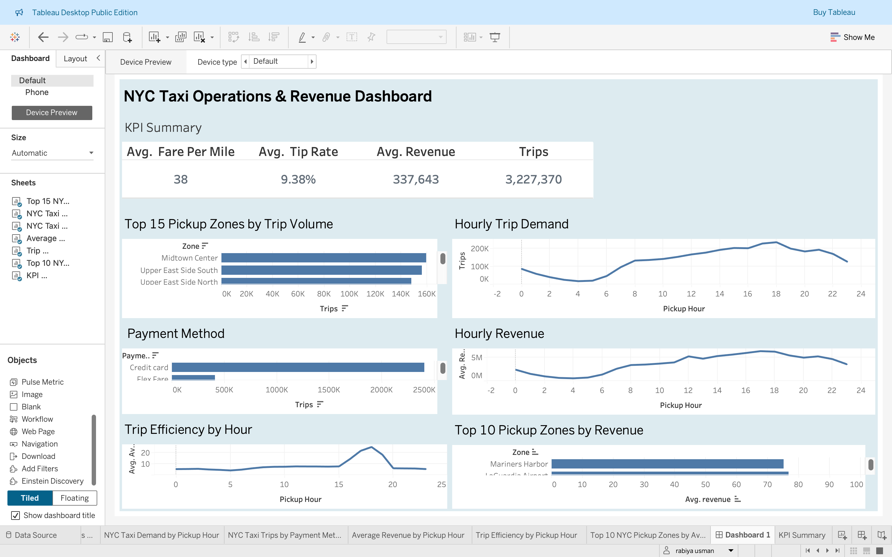

# NYC Taxi Operations & Revenue Dashboard

An end-to-end data analytics project analyzing NYC taxi trip operations, demand patterns, revenue performance, payment behavior, and trip efficiency using Python and Tableau.

## Project Overview

This project transforms raw NYC taxi trip data into a structured analytical dataset and an interactive Tableau dashboard designed to answer key operational and business questions.

The analysis focuses on:

- Trip volume and demand patterns
- Pickup-zone performance
- Hourly trip demand
- Revenue trends
- Payment method distribution
- Trip efficiency by hour
- Revenue performance across pickup zones

## Business Questions

The project investigates:

1. Which pickup zones generate the highest trip volumes?
2. When is taxi demand highest throughout the day?
3. How does revenue vary by pickup hour?
4. Which payment methods dominate taxi transactions?
5. At which hours is trip efficiency highest?
6. Which pickup zones generate the highest average revenue?
7. What operational patterns can help improve taxi fleet planning?

## Tech Stack

- **Python** — Data cleaning, transformation, and analysis
- **Pandas** — Data manipulation and aggregation
- **Jupyter Notebook** — Exploratory Data Analysis
- **Tableau** — Interactive visualization and dashboard development
- **Git & GitHub** — Version control and project management
## Project Workflow

Raw NYC Taxi Data
↓
Data Cleaning & Transformation
↓
Feature Engineering & Aggregation
↓
Processed Analytical Datasets
↓
Tableau Visualization
↓
Interactive Operations & Revenue Dashboard

## Interactive Tableau Dashboard

View the full interactive dashboard on Tableau Public:

[Open NYC Taxi Operations & Revenue Dashboard](https://public.tableau.com/views/NYCTaxiOperationsRevenueDashboard/Dashboard1?:language=en-US)

## Dashboard Preview

